# AWS intro

    Amazon Web Services (AWS) is the world’s most comprehensive and broadly adopted cloud, offering over 200 fully featured services from data centers globally. Millions of customers—including the fastest-growing startups, largest enterprises, and leading government agencies—are using AWS to lower costs, become more agile, and innovate faster.


How to launch an EC2 instance?

1. Make an AWS account by following all the steps on the AWS.

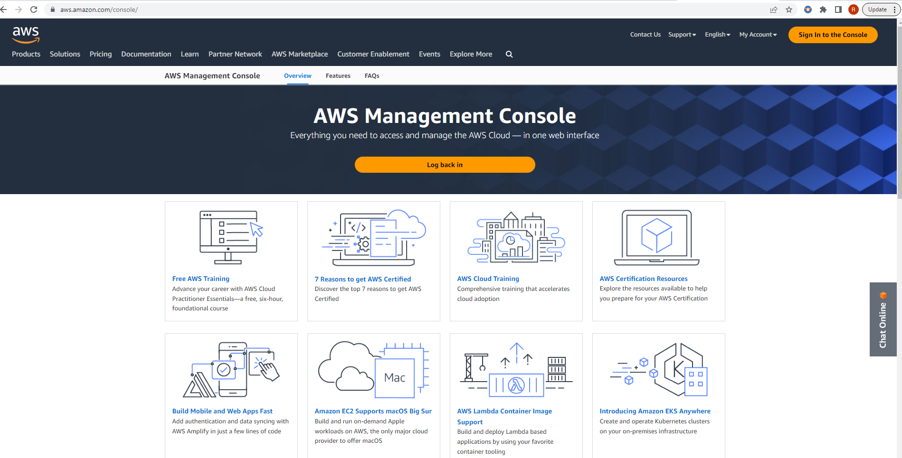

2. Go to search bar and type in EC2. Make sure to choose your region. 

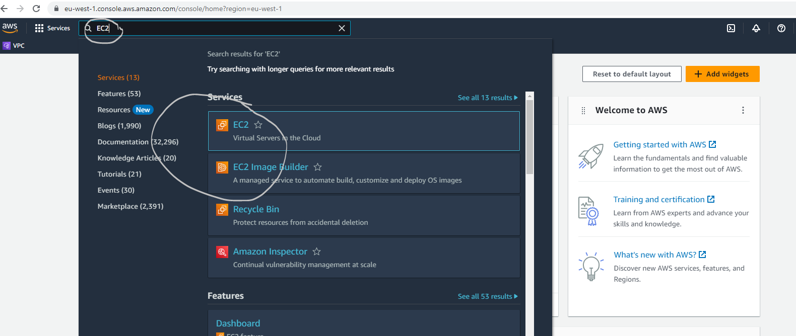

3. Go to instances and name your VM, Choose an OS image, Instance type, key pair and Security group.
   
 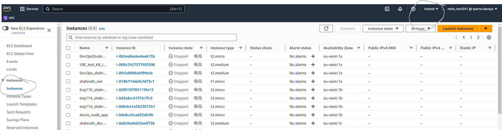

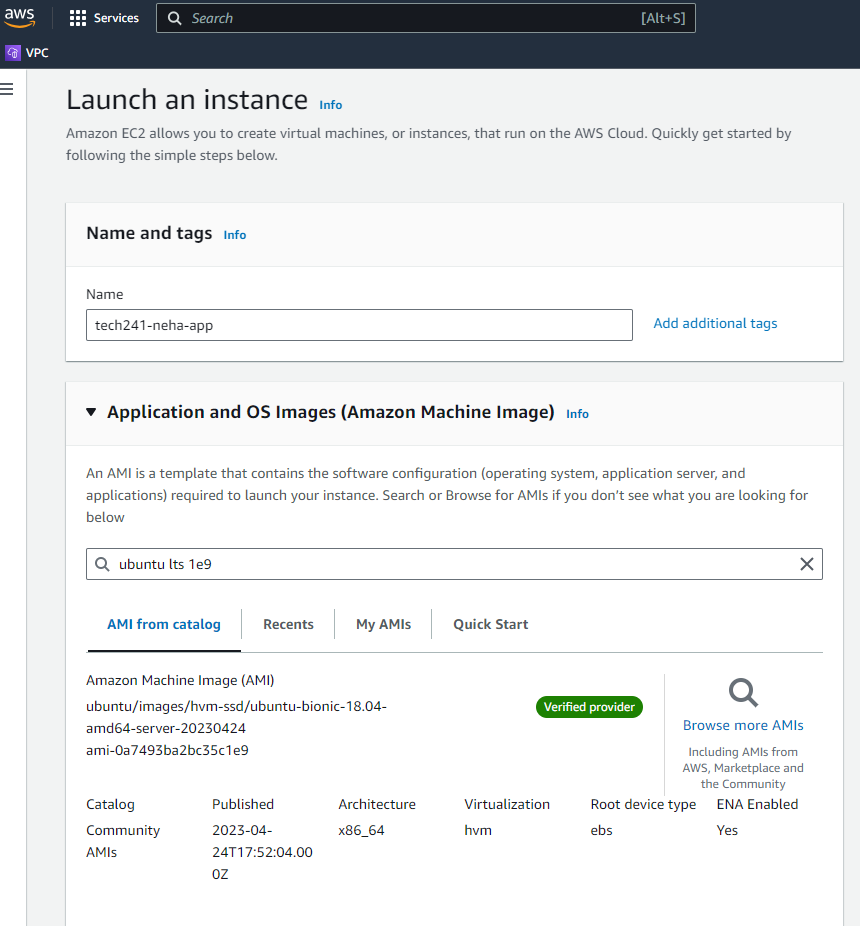

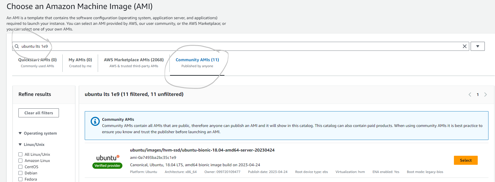

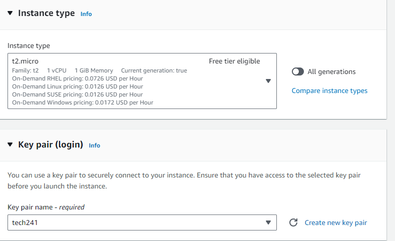

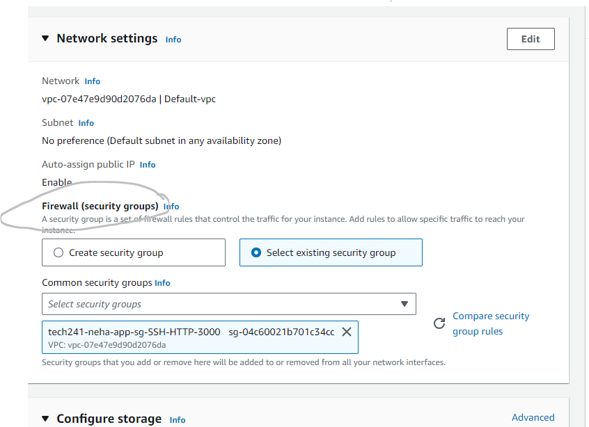

4. You can make a new security group and open differnt ports based on your requirement or you can choose a security group already existing from your previous work.


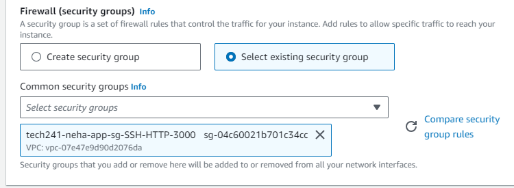


5. Select launch instance.

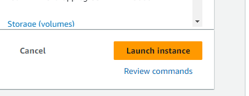

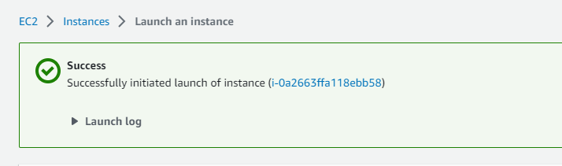

6. Make sure that the instance state shows 2/2 checks passed. Click on connect then.

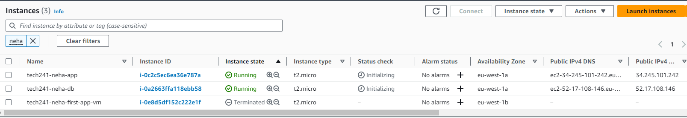


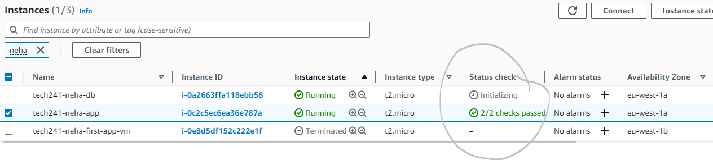


7. Follow these steps for DB_VM.


8. Go to SSH Client. and select the path at the bottem of the page.
   

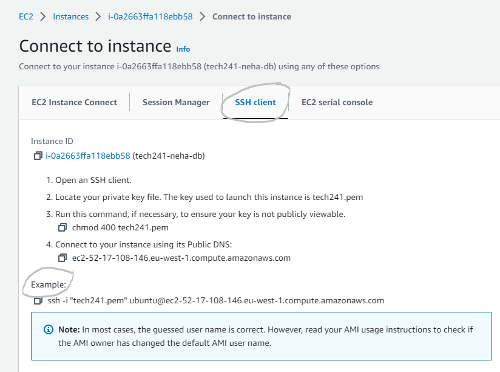

9. Open your Git Bash and add ssh -i "~/.ssh/<key name>"  

10.  Go to nano.provision.sh and paste this script.

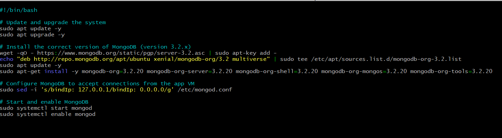
  
  If the commands have successfully run, you'll see this page.

  ](image-12.png)

  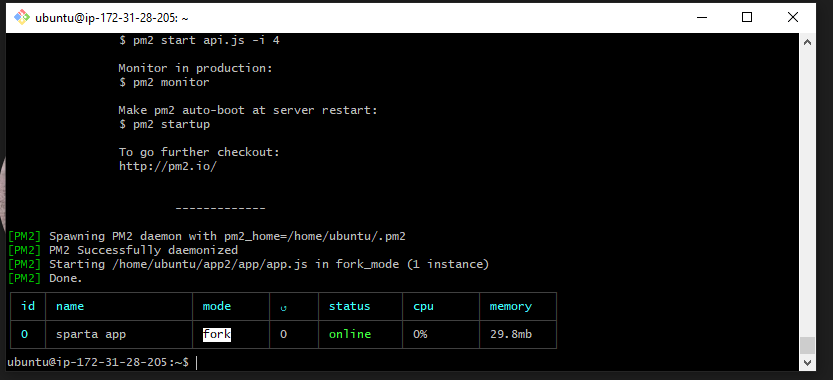

11.  After you have entered APP_VM_Ip:3000 in the browser, this front page of sparta_app is visible.

  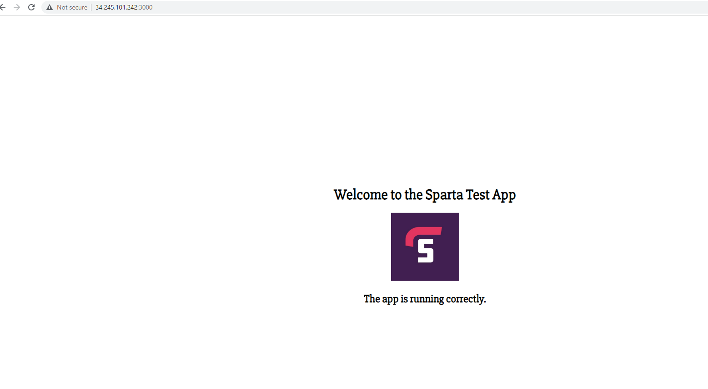


12. Connect to the App_VM using the same steps. But, run the app script.
    
```       #!/bin/bash

# update source list
sudo apt update -y

# upgrade all the packages and installs them in the kernal
sudo apt upgrade -y

# install nginx
sudo apt install nginx -y

# Start nginx on boot
sudo systemctl enable nginx

# start nginx
sudo systemctl start nginx

# status nginx
# sudo systemctl status nginx

# restart nginx
sudo systemctl restart nginx

# enable nginx - auto runs on startup
sudo systemctl enable nginx

# download node js
curl -sL https://deb.nodesource.com/setup_12.x | sudo -E bash -

# install node js
sudo apt install nodejs -y

# update source list
sudo apt update -y

# install pm2
sudo npm install -g pm2

# git clone app
git clone https://github.com/jungjinggg/tech241_sparta_app app2

# get into app folder
cd ~/app2/app

# creating new env variable
#export DB_HOST=mongodb://20.162.217.4:27017/posts

# install node js inside folder
npm install -y

# start app
pm2 start app.js --name "sparta app"
#nohup ./app2 &
#nohup node app.js &
#nohup command &

# status nginx
# sudo systemctl status nginx
```
    

13. In the env variable, change MongoDb ip to your DB_VM_public Ip


  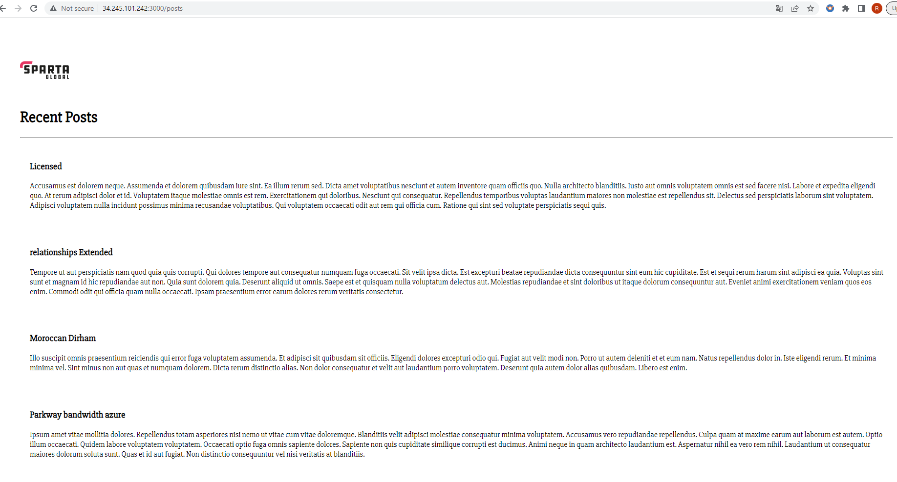


14.  In your browser paste, your app_vm_ip:3000/posts

  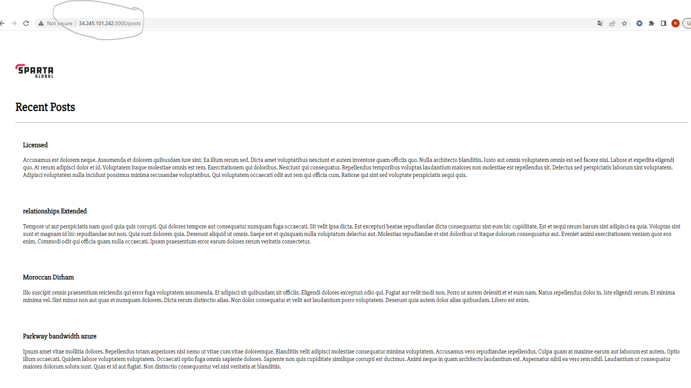

15. To set automatic reverse proxy, use the following commands in App script after nginx installation commands and then restart nginx. 

    ```
    sudo sed -i 's#try_files $uri $uri/ =404;#proxy_pass http://localhost:3000;#g' /etc/nginx/sites-available/default

    sudo systemctl restart nginx
    ```

16. Use     cat  /etc/nginx/sites-available/default     to check if your reverse proxy config is altered.

17. To check, if reverse proxy is set, just use app_vm_ip in the browser and the sparta app or your web page should load without adding the port number.


18. To stop or terminate any instance, select the instance you want to stop and then click on instance state. From dropdown list, choose the relevant option.


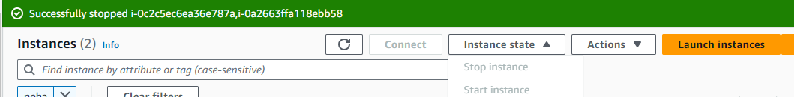


