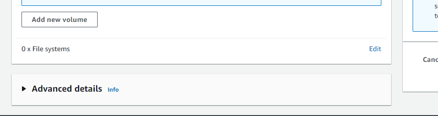
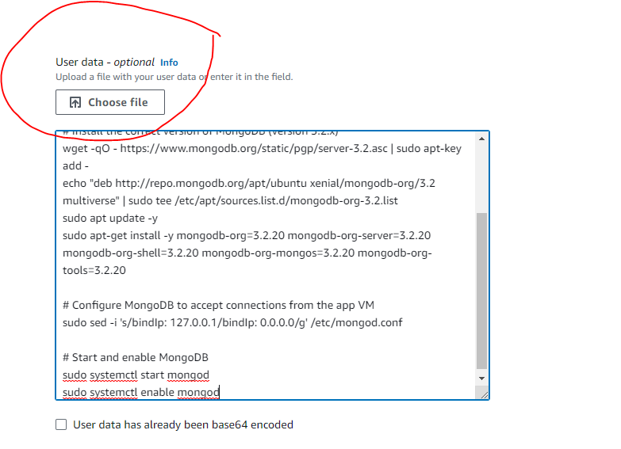
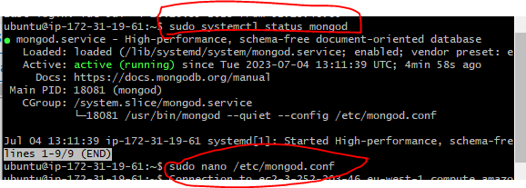
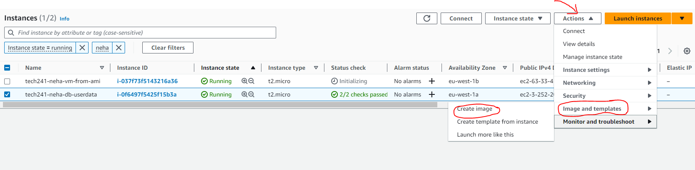
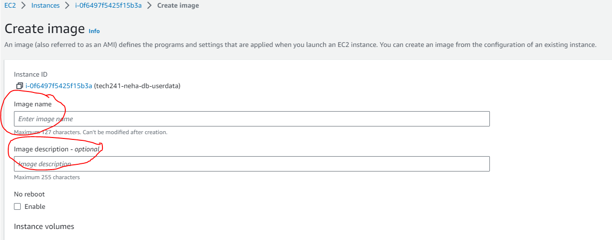
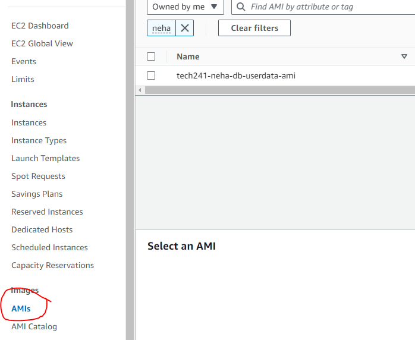
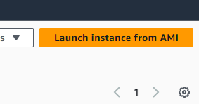
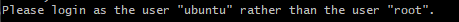
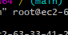
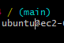

1. Log into your AWS console.
2. Go to EC2 and create a new VM.
3. Use Ubuntu 18.04 LTS (ending in 1e9 from Community AMIs) and t2.micro as your instance type.
4. Choose an existing KEYPAIR or make a new keypair. 
5. For Network settings, create a new Security Group or Use an existing one. (We only need ports: 22 and 27017 open.)
6. Go to Advanced Details. Scroll to the end where it says User data.

7. In the box below User Data, paste your MongoDB script with the BindIp configured.

 

8. Launch Instance and wait for the instance to be in running state.

9. Once the instance is running, connect to git bash using SSH Client credentials. 

10. Use commands, to check if your mongodb is running.
    1.  sudo systemctl status mongod

11. Use this command to check, if your BindIp is altered.
    2.  sudo nano /etc/mongod.conf

12. To create an AMI from your VM, go to Actions ---> Image and templates ---> Create Image

13. Choose an image name and a description.

14. Add a tag to identify your AMI. and click Create Image.

15. Go to AMI on the EC2 dashboard and you'll see your AMI created there.

16. To launch an instance from AMI, click on Launch instance from AMI on the top right corner.

17. You will need to choose your Instance name, KeyPair and Security group on this instance. Once this is done, you can click launch instance and you have a VM identical to your AMI.

18. Follow the same steps to connect using SSH Client.

19. To login as ubuntu user, just change root to ubuntu.

