## Terraform

Terraform is an open-source infrastructure as code (IaC) software tool developed by HashiCorp. 
It allows users to define and provision a data center infrastructure, such as virtual machines, networks, storage, and more using a declarative configuration language. 
With Terraform, you can describe your desired infrastructure in code, and it will handle the provisioning and management of the underlying resources across various cloud providers or on-premises infrastructure.

## Why Terraform and the benefits

1. Declarative Configuration: Terraform uses a declarative configuration language to define the desired state of the infrastructure. Users describe the resources they need and their relationships, rather than specifying a sequence of steps to achieve the desired state.

2. Infrastructure as Code (IaC): Terraform treats infrastructure as code, allowing for version control, collaboration, and reuse of configurations. This helps in tracking changes, managing deployments, and maintaining consistency across environments.

3. Multi-Cloud and Multi-Provider Support: Terraform is cloud-agnostic and supports multiple cloud providers such as Amazon Web Services (AWS), Microsoft Azure, Google Cloud Platform (GCP), and more. It can also manage on-premises infrastructure and other services like DNS providers.

4. Resource Provisioning and Dependency Management: Terraform determines the order in which resources are provisioned based on dependencies specified in the configuration. It ensures that resources are created and managed in a controlled and consistent manner.

5. State Management: Terraform maintains a state file that keeps track of the actual resources created in the cloud. This allows Terraform to know what resources are currently managed and helps with future updates and changes.

6. Modularity and Reusability: Terraform configurations can be modularized and organized into reusable modules. This promotes code reuse and simplifies the management of complex infrastructures.

7. Plan and Apply: Terraform follows a "plan and apply" workflow. First, it generates a "plan" that shows the changes it intends to make to achieve the desired state. After reviewing the plan, the user can then "apply" it to execute the changes.

## Installation of Terraform

1. Go to Hashicorp Terraform official website and download the latest Terraform version for Windows.

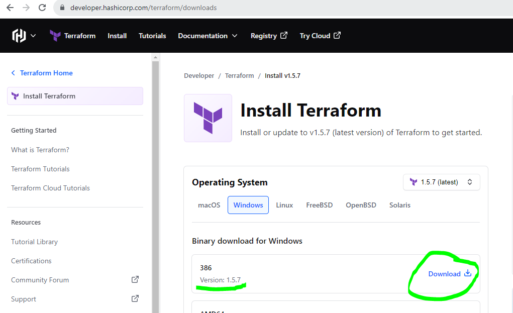

2. Extract the zip file by right clicking on it. 
3. Cut and paste the Terraform files to Program Files.
4. Copy the path of the terraform.exe file.

5. Go to Edit the system environment variables on your computer and click on the "Environment Variables".
6. In the System Variables section click on Path and then select the Edit option.

7. Click New and paste the terraform.exe path here. Click OK and again OK to save the path.
   
  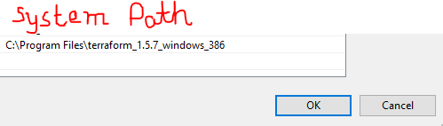 

8. Now go to command prompt and type:

    terraform -version

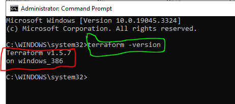

If Terraform is correctly installed and added to the system PATH, it will display the version information.

## To install AWS CLI

Use this command to download AWS CLI in powershell or the command prompt.

    msiexec.exe /i https://awscli.amazonaws.com/AWSCLIV2.msi

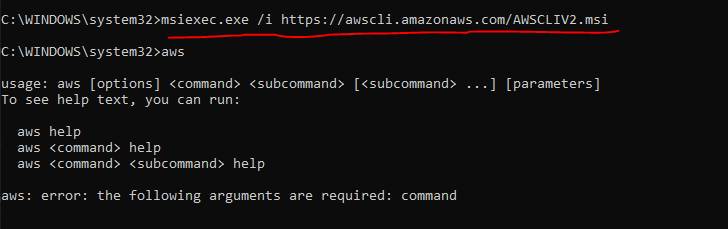

Use the command "aws" to check if AWSCLI has successfully installed.

## Connect to AWS Cloud

1. Log into AWS account to proceed with the below steps.

2. Create an IAM programmatic user with administrator access.

    aws configure 

3. For Configure credentials, go to IAM -> Users -> Security Credentials -> Access Keys -> create Access key -> Download the Access Key.

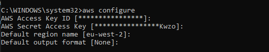

4. To test the connection, use this command: 
    
    aws s3 ls

## Terraform Workflow

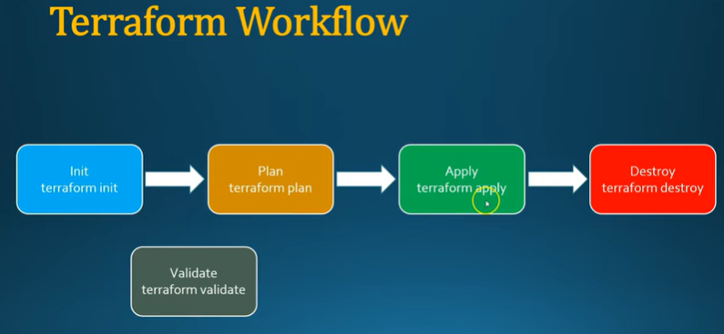

# Use https://registry.terraform.io/browse/providers to provision infrastructure for your cloud/service provider.

For AWS infrastructure provisioning, go to USE PROVIDER and follow the steps.

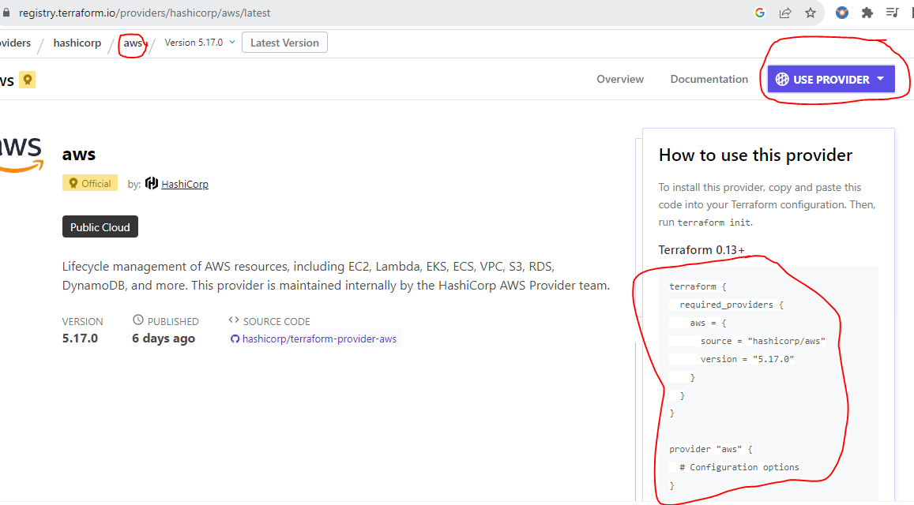

## To provision ec2 instance, use the syntax for Resource Block. Each terraform file should have the extension .tf added to the name.

For further info, use this link
https://registry.terraform.io/providers/hashicorp/aws/latest/docs#argument-reference

## Write your 1st terraform file

1. Let's create an EC2 instance as part of our 1st terraform file

2. To create an ec2 instance, We should connect to aws account first

3. In terraform file we can connect to AWS cloud using 'provider block' to create an ec2 instance, should use 'resource block'

4. In the provider block, mention the cloud name, and region name

    provider "aws" {
    project = "first-ec2-instance"
    region  = "eu-west-2"
    }

5. In the resource block, We should mention information to create an instance.

6. To create an EC2 instance (object), we should have the below information

    Instance name
    Operating system (AMI)
    instance Type
    Keypair
    VPC
    Storage

7. But among these, AMI id, instance type, and keypair are required arguments. These should be defined in the resource block.

resource "aws_instance" "terraform-demo" {
  ami = "ami-07dc0b5cad2999c28"
  instance_type = "t2.micro"
  key_name = "ansible-key"
  
}

8. So the final file looks like this.

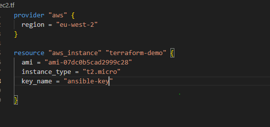

9. Go to Terminal and start a new terminal.

10. Use "terraform init" (to Initialize Terraform)
11. Use "terraform validate" (to check if your config is valid)

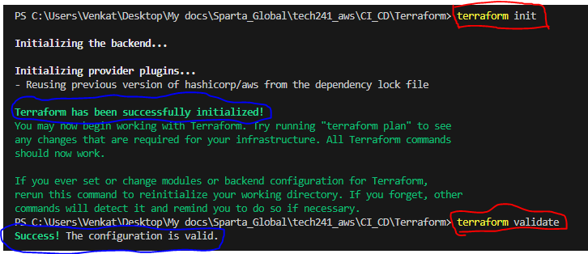

12. Use "terraform plan" (to check what would be added/changed/destroyed)

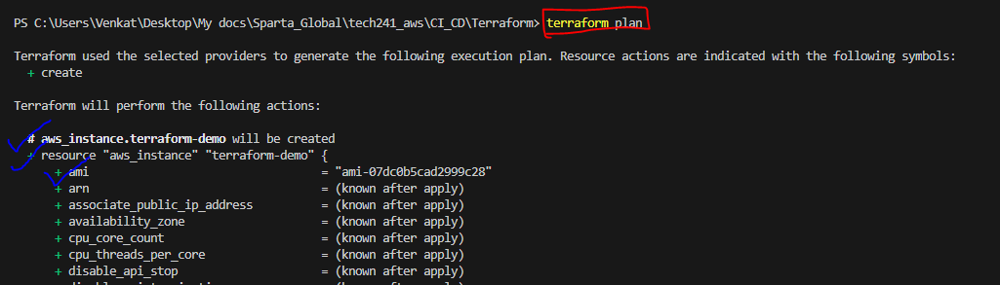

13. Use "terraform apply" (to apply the additions/changes/deletions etc. )
    
14. In this case, you will see a new ec2 instance being provisioned on AWS.
   
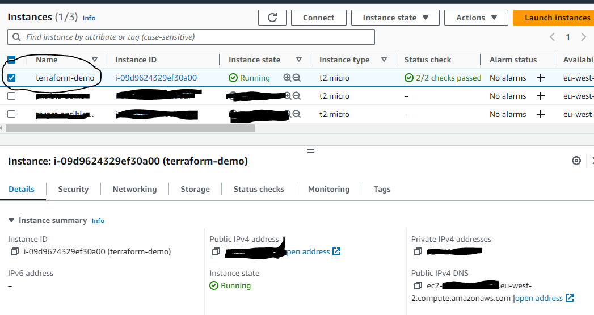

15. Use "terrafrom destroy" to destroy our infrastructure which we have provisioned using terraform.

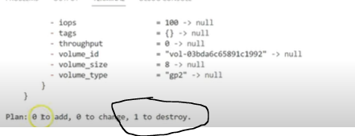

The ec2 instance will terminate on AWS.

## Terraform file to provision VPC and EC2

https://registry.terraform.io/providers/hashicorp/aws/latest/docs/resources/vpc.html

So far, we have created an EC2 instance with the Security group. Now let's create these in a separate VPC. For that, we need to create VPC first.

In VPC, there are various steps involved.

Create VPC
Create a Subnet
Create Internet Gateway
Create RouteTable
Route Table Association

### 1. Launch EC2 in VPC using Terraform

    // Create EC2

    provider "aws" {
    region = "eu-west-2"
    }

    resource "aws_instance" "terraform-demo" {
    ami = "ami-07dc0b5cad2999c28"
    instance_type = "t2.micro"
    key_name = "ansible-key"
    associate_public_ip_address = true
    subnet_id = aws_subnet.terraform-demo-subnet.id
    vpc_security_group_ids = [aws_security_group.terraform-demo-vpc-sg.id]
    }

    // Create VPC
    resource "aws_vpc" "terraform-demo-vpc" {
        cidr_block = "10.10.0.0/16"
        tags = {
            Name = "terraform-demo-vpc"
        }
    }

    // Create subnets

    resource "aws_subnet" "terraform-demo-subnet" {
    vpc_id     = aws_vpc.terraform-demo-vpc.id
    cidr_block = "10.10.1.0/24"
    map_public_ip_on_launch = true
    tags = {
        Name = "terraform-demo-subnet"
    }
    }

    // Create Internet Gateway

    resource "aws_internet_gateway" "terraform-demo-igw" {
        vpc_id = aws_vpc.terraform-demo-vpc.id
        tags = {
        Name = "terraform-demo-igw"
        }
    }

    // Create a route table 

    resource "aws_route_table" "terraform-demo-rt" {
        vpc_id = aws_vpc.terraform-demo-vpc.id

        route {
            cidr_block = "0.0.0.0/0"
            gateway_id = aws_internet_gateway.terraform-demo-igw.id
        }

        tags = {
        Name = "terraform-demo-rt"
        }
    }

    // Associate subnet with route table

    resource "aws_route_table_association" "terraform-demo-rta" {
        subnet_id = aws_subnet.terraform-demo-subnet.id
        route_table_id = aws_route_table.terraform-demo-rt.id

    }

    // Create Security Group

    resource "aws_security_group" "terraform-demo-vpc-sg" {
    name        = "terraform-vpc-sg"
    vpc_id      = aws_vpc.terraform-demo-vpc.id

    ingress {
        
        from_port        = 22
        to_port          = 22
        protocol         = "tcp"
        cidr_blocks      = ["0.0.0.0/0"]
        ipv6_cidr_blocks = ["::/0"]
    }

    egress {
        from_port        = 0
        to_port          = 0
        protocol         = "-1"
        cidr_blocks      = ["0.0.0.0/0"]
        ipv6_cidr_blocks = ["::/0"]
    }

    tags = {
        Name = "allow_tls"
    }
    }

